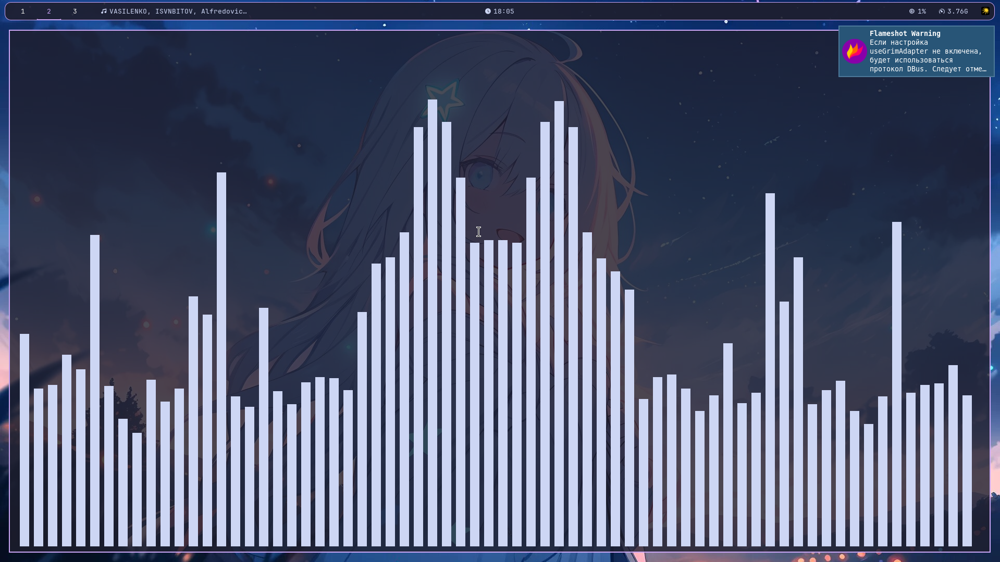

## 🖼️ Галерея Системы (S-Rank)

| 🌐 Браузер (Floorp) | 🌌 Чистый стол | 🔊 Визуализатор (Cava) | 📟 Статус и Система |
| :---: | :---: | :---: | :---: |
|  |  |  |  |

---

## 🖥️ The Stack

| Component | Choice |
| :--- | :--- |
| **OS** | Arch Linux 󰣇 |
| **WM** | [Sway](https://swaywm.org/) |
| **Shell** | Zsh + Starship |
| **Terminal** | Foot |
| **Launcher** | Rofi (Wayland) |
| **Visualizer**| Cava |

---

## 🚀 Быстрый старт

1. **Установите зависимости:**
   `sudo pacman -S $(cat packages.txt)`

2. **Примените конфигурацию:**
   `stow sway waybar foot zsh rofi scripts starship cava`

---

## 🛠️ Функционал скриптов

### 📊 System Info
Вызывается командой `sys` или `system-info`. Выводит кастомное окно статуса с аптаймом, маной (RAM) и нагрузкой на проц.

### 🖼️ Wallpapers
Скрипт `random_wall.sh` отвечает за смену обоев. Чтобы он работал при старте, добавь в конфиг Sway:
`exec_always ~/.local/bin/random_wall.sh`

### 📖 Manga Mode
Настройки для чтения манги и манхвы, оптимизированные под управление жестами или горячими клавишами.

---

## 📂 Структура репозитория
* `zsh/` — настройки оболочки и плагины.
* `scripts/` — полезные скрипты, которые Stow прокидывает в `~/.local/bin`.
* `starship/` — кастомный промпт для терминала.
* `cava/` — аудио-визуализатор.

*Сделано с ❤️ на Arch Linux.*
